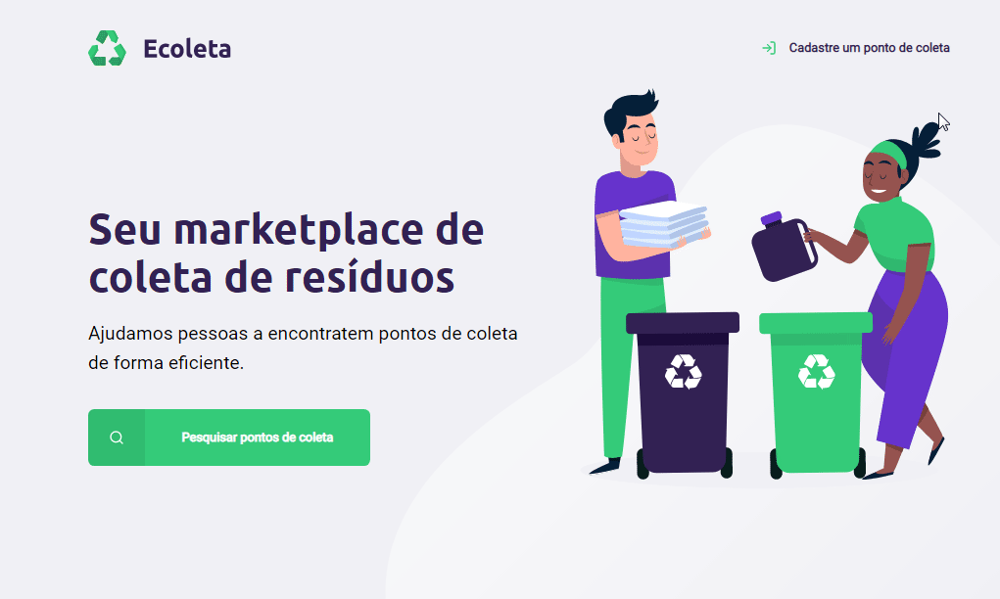
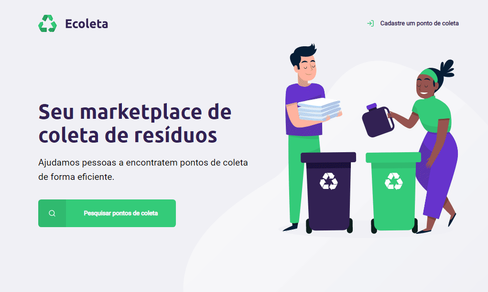

<h1 align="center">
  :rocket: Next Level Week :rocket:
</h1>

  

  
  
  
  

---

  

## Projeto
**Ecoleta** é um projeto que visa ajudar as pessoas a encontrar pontos de descarte de materiais para reciclagem de uma forma simples e rápida.  
O desenvolvimento ocorreu durante a Next Level Week da [Rocketseat](https://rocketseat.com.br/).
 

---
- ## :computer: Web

  

  

---
## Tecnologias

Esse projeto utilizou as seguintes tecnologias:

- [Node.js](https://nodejs.org/en/)
- [Express](https://expressjs.com/pt-br/)
- [Nunjucks](https://mozilla.github.io/nunjucks/)

---
## Licença

[LICENSE](LICENSE) & [Rocketseat](https://rocketseat.com.br/)

---
:shipit: